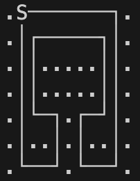
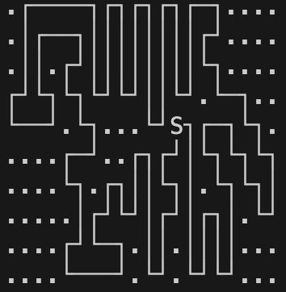
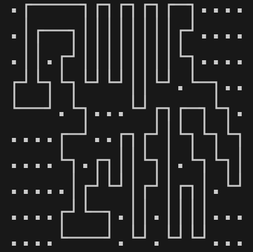
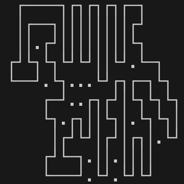
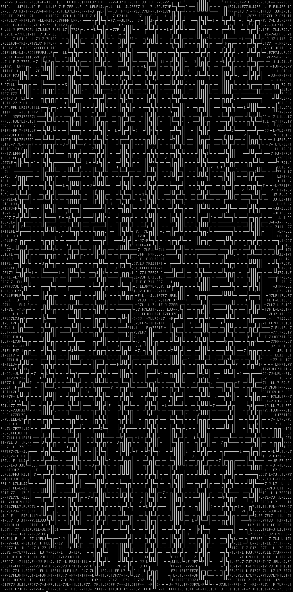
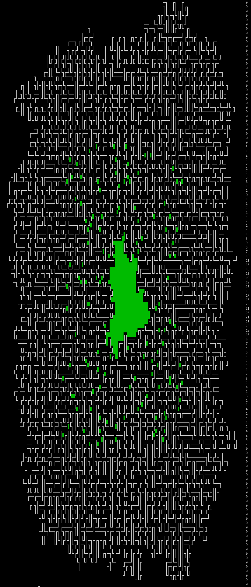

# Day 10 solution

Part 2 was _tough_! 

I did a set of things here that finally led me to the answer: 

1. Replaced the hard to visualise `|`, `-`, `F`, `7`, `J` and `L` with unicode characters `│` , `─`, `┌`, `┐`,  `┘`, `└`. 

|Input|test3.txt|test4.txt|test5.txt|
|---|---|---|---|
|Output|  |  |  |

2. Replace `S` with the correct pipe replacement.

|Input|test3.txt|test4.txt|test5.txt|
|---|---|---|---|
|Output|  |  |  |

3. Clean the above by removing the characters from the side ie, replace all characters with a whitespace in each line before the first character from pipe path is encountered.

|Input|test3.txt|test4.txt|test5.txt|
|---|---|---|---|
|Output|  |  |  |

4. Now that we have an input we can work with, we will count the number of characters inside the pipe path using [Ray Cast Algorithm](https://en.wikipedia.org/wiki/Point_in_polygon). We are doing this by evaluating the 2D matrix line by line: 
    1. Keep track of number of `│` encountered. If this count is odd, the character encountered is inside the path pipe. 
    2. We can ignore any `─` encountered. 
    3. We can mostly (see next point) ignore all other pipe path characters ie `┌`, `┐`,  `┘`, `└`. 
    4. We need to increment the `│` counter by one when either (`┌` followed by `┘`) or (`└` followed by `┐`) is encountered, as these are equivalent to a single `│`. Note, the characters can have any number of `─` between them and they would still be counted as a single `│`. 

|Input|test3.txt|test4.txt|test5.txt|
|---|---|---|---|
|Output|  |  |  |

----- 

Doing the above steps for the input:

|After Step 1|After Step 2|After Step 3|After Step 4|
|---|---|---|---|
||  |  |  | 